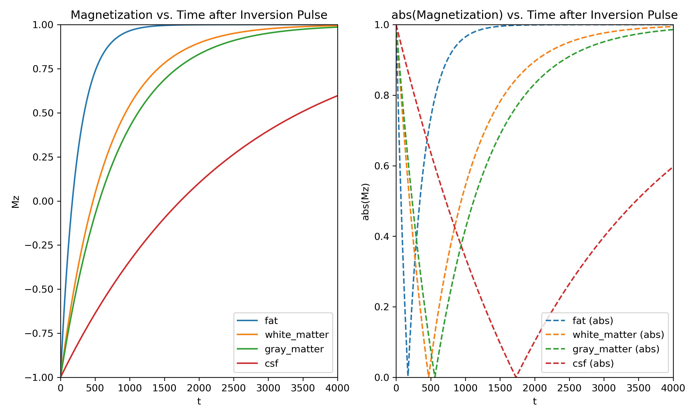
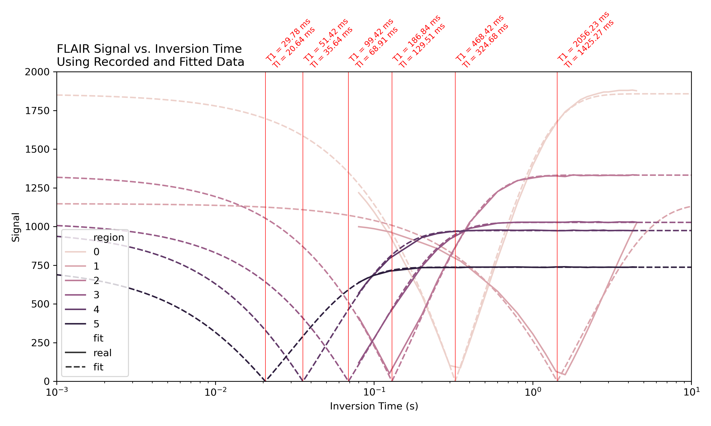
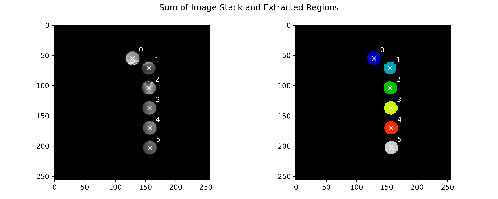
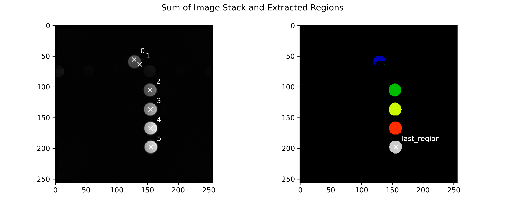
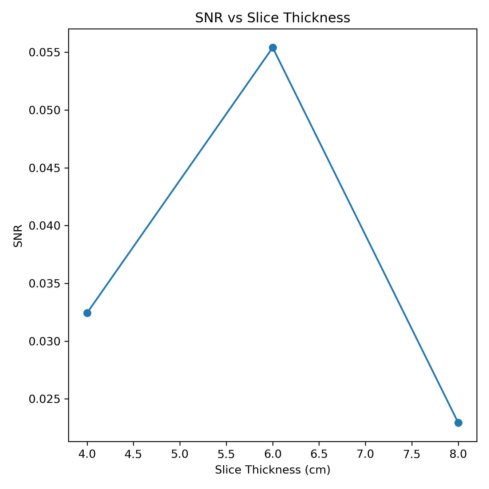

# Homework 2 (Lab 1)- BMED 6210 / Spring 2023

Stefan Abi-Karam

## Pre-Lab Questions

### Question 1 + Question 2

> Plot the magnetization Mz after an Inversion pulse as a function of time for fat, white matter, gray matter, and CSF. You can use the equation for longitudinal magnetization that were given in class.

> Plot the magnitude of Mz for each tissue above.

Below is a plot that shows both the Mz and the magnitude of Mz after the inversion pulse for each material.



I built the equation for the magnetization of each material after the inversion pulse symbolically using `sympy`, assuming the inversion pulse is 180 degrees. The code below is the main function that does this.

```python
import sympy as sp

T1_values={
    "fat": 250-3,
    "white_matter": 680-3,
    "gray_matter": 810-3,
    "csf": 2500-3,
}

equations = {}

for material, T1_val in T1_values.items():
    M0 = sp.Symbol("M0")
    T1 = sp.Symbol("T1")
    Mz = sp.Symbol("Mz")
    t = sp.Symbol("t")
    right = -M0*sp.exp(-t/T1) + M0*(1-sp.exp(-t/T1))
    eq = right.subs(T1, T1_val).subs(M0, 1)
    equations[material] = eq
```

### Question 3

> Estimate the TI to null fat and CSF fluid using curve fitting

Since I constructed the equations symbolically, I can just use the symbolic math library I used to construct the equations to solve for the TI. The code below does this.

```python
for material, eq in equations.items():
    print(f"{material}: {eq}")
    t_eq = sp.solve(eq, "t")[0]
    print(f"t_eq: {t_eq.evalf()}")
```

I get the following results:

```text
fat: 1 - 2*exp(-t/247)
t_eq: 171.207353598306
white_matter: 1 - 2*exp(-t/677)
t_eq: 469.260641239083
gray_matter: 1 - 2*exp(-t/807)
t_eq: 559.369774711876
csf: 1 - 2*exp(-t/2497)
t_eq: 1730.78850985818
```

However, I know I will need the curve fitting later for the lab when I have sample data points instead of symbolic equations. So, I wrote a function that also does the curve fitting using a global optimization solver. This is the solver I used later in the lab to fit my data. The code below is the main part of what I implemented.

```python
import numpy as np
from scipy.optimize import dual_annealing

def IR_func(t, T1, M0):
    return np.abs(M0 * (1 - 2 * np.exp(-t / T1)))

def IR_func_jac(t, T1, M0):
    return np.array([
        -2*M0*t*np.exp(-t/T1)*np.sign(1 - 2*np.exp(-t/T1))/T1**2,
        np.abs(1 - 2*np.exp(-t/T1))
    ]).T

def mse_loss(y_true, y_pred):
    return np.mean((y_true - y_pred)**2)

def rmse_loss(y_true, y_pred):
    return np.sqrt(np.mean((y_true - y_pred)**2))

def curve_fit_FLAIR(t, signal):

    def loss_func(params):
        return rmse_loss(signal, IR_func(t, *params))
    
    res = dual_annealing(loss_func, bounds=[(1e-9, 10), (1e-9, 10000)])

    return res.x
```

I found that using a dual annealing optimizer with an RMSE loss performed best for this problem. I also tried other approaches like basin hopping and differential evolution, but they did not perform as well, even given variable bounds and the Jacobian of the function for the local optimizer.

### Question 4

> Derive a relationship between T1 and TI for the IR sequence.

Just solve for TI in the following equation:

```text
0 = -M0*exp(-TI/T1) + M0*(1-exp(-TI/T1))
```

My answer: `T1 = ln(T1)`

## Lab Exercises - Inversion Recovery

> Turn in a picture of the tubes with T1 values for each tube. Does IR data from the lab experiment conform to theory? Comment of what may cause any deviation.

Below is a plot of the measured and fitted signals of each tube as the inversion time is changed per scan. The T1 and TI values are also plotted on the graph.



The region labels correspond to the following labeling of the tubes:



The data and fitted equations match very well with each other, verifying the derived equations in the first part of the assignment. However, there is some variation between the recorded data and fitted data, which may be attributed to other causes such as other sources of decay and lack of data sampled at a wide range of inversion times. Interestingly, there are some tubes that have a TI point that was less than the possible TI value you can set for the scanner to do; I think 60ms. This means you can't null stuff in the image with a TI less than 60ms.

## Lab Exercises - Signal to Noise (SNR) and Resolution Background

> Plot voxel size as a function of SNR for all of the collected images in one of the tubes. Do they agree with theory? Comment on why or why not.

I use the same ROI extraction method as in the previous section but only use the bottom-rightmost tube region as my ROI. See the figure below for the ROI.



Below is a plot of the signal-to-noise ratio (SNR) as a function of slice thickness (which is directly related to voxel size in this setup, since the Pixel Spacing for x and y is the same for all collected images).



This does not look correct since the larger the slice thickness, the higher the SNR should be. I believe the issue is a data collection problem. For some reason, we must have acquired more than two images for some thicknesses and only one for others. I double-checked this using the embedded DICOM metadata in the images; see the table below.

```text
                                            img_name  slice_thickness
9  TEST.MR.NEUROLOGY_-_HUDDLESTON_IRBD_ATYPICAL.0...             0.02
4  TEST.MR.NEUROLOGY_-_HUDDLESTON_IRBD_ATYPICAL.0...             0.03
7  TEST.MR.NEUROLOGY_-_HUDDLESTON_IRBD_ATYPICAL.0...             0.04
2  TEST.MR.NEUROLOGY_-_HUDDLESTON_IRBD_ATYPICAL.0...             0.04
8  TEST.MR.NEUROLOGY_-_HUDDLESTON_IRBD_ATYPICAL.0...             0.06
3  TEST.MR.NEUROLOGY_-_HUDDLESTON_IRBD_ATYPICAL.0...             0.06
5  TEST.MR.NEUROLOGY_-_HUDDLESTON_IRBD_ATYPICAL.0...             0.08
0  TEST.MR.NEUROLOGY_-_HUDDLESTON_IRBD_ATYPICAL.0...             0.08
6  TEST.MR.NEUROLOGY_-_HUDDLESTON_IRBD_ATYPICAL.0...             0.08
1  TEST.MR.NEUROLOGY_-_HUDDLESTON_IRBD_ATYPICAL.0...             0.08
```

If we could collect the data correctly and more comprehensively, I could look at more than three points of slice thickness and see if I made a mistake in my analysis, code, or data itself. There could also be artifacts that caused the one outlier in this plot.

## Appendix

### Code for `pre_lab_stuff.py`

```python
import sympy as sp
import numpy as np
import matplotlib.pyplot as plt


T1_values={
    "fat": 250-3,
    "white_matter": 680-3,
    "gray_matter": 810-3,
    "csf": 2500-3,
}

equations = {}

for material, T1_val in T1_values.items():
    M0 = sp.Symbol("M0")
    T1 = sp.Symbol("T1")
    Mz = sp.Symbol("Mz")
    t = sp.Symbol("t")
    right = -M0*sp.exp(-t/T1) + M0*(1-sp.exp(-t/T1))
    eq = right.subs(T1, T1_val).subs(M0, 1)
    equations[material] = eq

fig, ax = plt.subplots(1, 2, figsize=(10, 6))
for material, eq in equations.items():
    print(f"{material}: {eq}")
    eq_plot = sp.lambdify("t", eq, "numpy")
    t = np.linspace(0, 4000, 1000)
    Mz = eq_plot(t)
    line = ax[0].plot(t, Mz, label=material)
    color = line[0].get_color()
    ax[1].plot(t, np.abs(Mz), color=color, ls="--", label=f"{material} (abs)")
    t_eq = sp.solve(eq, "t")[0]
    print(f"t_eq: {t_eq.evalf()}")

ax[0].set_title("Magnetization vs. Time after Inversion Pulse")
ax[0].set_xlim(0, 4000)
ax[0].set_ylim(-1, 1)
ax[0].set_xlabel("t")
ax[0].set_ylabel("Mz")

ax[1].set_title("abs(Magnetization) vs. Time after Inversion Pulse")
ax[1].set_xlim(0, 4000)
ax[1].set_ylim(0, 1)
ax[1].set_xlabel("t")
ax[1].set_ylabel("abs(Mz)")

ax[0].legend()
ax[1].legend()

plt.tight_layout()
plt.savefig("pre_lab_stuff.png", dpi=300)
```

### Code for `IR_curve_fit.py`

```python
import sympy as sp
import numpy as np
import matplotlib.pyplot as plt
from scipy.optimize import dual_annealing


def gen_fake_data(T1, M0):
    t = np.array([80, 100, 150, 200, 300, 400, 600, 800, 1000, 1200, 1400, 1600, 1800, 2000, 2200, 2400, 2600, 2800, 3000])* 1e-3

    s_t = sp.symbols("t", real=True, positive=True)
    s_T1 = sp.symbols("T1", real=True, positive=True)
    s_M0 = sp.symbols("M0", real=True, positive=True)

    s_MZ = s_M0 * (1 - 2 * sp.exp(-1*s_t / s_T1))

    s_signal = sp.Abs(s_MZ)
    signal_func = sp.lambdify((s_t, s_T1, s_M0), s_signal, "numpy")
    signal = signal_func(t, T1, M0)

    # jac = sp.Matrix([s_signal]).jacobian([s_T1, s_M0])
    # jac_func = sp.lambdify((s_t, s_T1, s_M0), jac, "numpy")

    noise = np.random.normal(0, 0.02*M0, len(t))
    signal_noise = signal + noise

    return t, signal, signal_noise


def IR_func(t, T1, M0):
    return np.abs(M0 * (1 - 2 * np.exp(-t / T1)))

def IR_func_jac(t, T1, M0):
    return np.array([
        -2*M0*t*np.exp(-t/T1)*np.sign(1 - 2*np.exp(-t/T1))/T1**2,
        np.abs(1 - 2*np.exp(-t/T1))
    ]).T

def mse_loss(y_true, y_pred):
    return np.mean((y_true - y_pred)**2)

def rmse_loss(y_true, y_pred):
    return np.sqrt(np.mean((y_true - y_pred)**2))

def curve_fit_FLAIR(t, signal):

    def loss_func(params):
        return rmse_loss(signal, IR_func(t, *params))
    
    res = dual_annealing(loss_func, bounds=[(1e-9, 10), (1e-9, 10000)])

    return res.x
 

if __name__ == "__main__":
    t, signal, signal_noise = gen_fake_data(2.300, 1000)

    res_x = curve_fit_FLAIR(t, signal_noise)

    print("T1 = ", res_x[0])
    print("M0 = ", res_x[1])

    plt.plot(t, signal, label="signal")
    plt.plot(t, signal_noise, label="signal_noise")
    plt.plot(t, IR_func(t, *res_x), label="fit")
    plt.legend()
    plt.show()
```

### Code for `TI_analysis.py`

```python
from pathlib import Path

import matplotlib.pyplot as plt
import matplotlib.transforms as transforms
import seaborn as sns
import numpy as np
import pandas as pd

from pydicom import dicomio

from skimage.filters import threshold_otsu
from skimage.segmentation import clear_border
from skimage.measure import label, regionprops
from skimage.morphology import closing, square

from IR_curve_fit import curve_fit_FLAIR, IR_func


data_dir = Path('./data')

image_files = list(data_dir.glob('**/*.IMA'))
image_files = [Path(f) for f in image_files]
image_files = sorted(image_files)

flair_images = [f for f in image_files if 'TFISEG-TI' in str(f)]

img_stack_list = []
for f in flair_images:
    img = dicomio.read_file(f)
    img_stack_list.append(img.pixel_array)

img_stack = np.array(img_stack_list).astype(float)
img_stack /= np.max(img_stack)
img_stack_sum = np.sum(img_stack, axis=0)

thresh = threshold_otsu(img_stack_sum)
bw = closing(img_stack_sum > thresh, square(3))
cleared = clear_border(bw)

label_image = label(cleared)
regions = regionprops(label_image)
regions = sorted(regions, key=lambda x: x.centroid[0] + x.centroid[1])

fig, ax = plt.subplots(1, 2, figsize=(10, 4))
ax[0].imshow(img_stack_sum, cmap=plt.cm.gray)
for idx, r in enumerate(regions):
    ax[0].plot(r.centroid[1], r.centroid[0], color='w', marker='x')
    ax[0].text(r.centroid[1] + 10 , r.centroid[0] - 10 , str(idx), color='w')
ax[1].imshow(label_image, cmap=plt.cm.nipy_spectral)
for idx, r in enumerate(regions):
    ax[1].plot(r.centroid[1], r.centroid[0], color='w', marker='x')
    ax[1].text(r.centroid[1] + 10 , r.centroid[0] - 10 , str(idx), color='w')
plt.suptitle('Sum of Image Stack and Extracted Regions')
plt.tight_layout()
plt.savefig('./regions.png', dpi=300)

image_data_df = pd.DataFrame(columns=['region', "TI", "signal"])
for flair_image_fp in flair_images:
    img = dicomio.read_file(flair_image_fp)
    img_data = img.pixel_array    
    TI = float(img["InversionTime"].value) * 1e-3

    for idx, r in enumerate(regions):
        pixel_coords = np.array(r.coords)
        pixel_values = img_data[pixel_coords[:, 0], pixel_coords[:, 1]]
        avg = np.median(pixel_values)

        image_data_df =  pd.concat([image_data_df, pd.DataFrame({
            'region': idx,
            'TI': TI,
            'signal': avg
        }, index=[0])])

# line plot with dotted line and x for each point
# sns.lineplot(data=image_data_df, x="TI", y="signal", hue="region", markers=True, dashes=True)
# plt.show()

region_fit_df = pd.DataFrame(columns=["region", "T1_fit", "M0_fit"])
for region in image_data_df.region.unique():
    region_df = image_data_df[image_data_df.region == region]
    region_df = region_df.sort_values(by="TI")
    TI = region_df.TI.values
    signal = region_df.signal.values

    res_x = curve_fit_FLAIR(TI, signal)
    region_fit_df = pd.concat([region_fit_df, pd.DataFrame({
        'region': region,
        'T1_fit': res_x[0],
        'M0_fit': res_x[1]
    }, index=[0])])

region_fit_df_for_table = region_fit_df.copy()
region_fit_df_for_table['region'] = region_fit_df_for_table['region'].astype(int)
region_fit_df_for_table['T1_fit'] = region_fit_df_for_table['T1_fit'] * 1e3
region_fit_df_for_table['M0_fit'] = region_fit_df_for_table['M0_fit']
region_fit_latex_table = region_fit_df_for_table.to_latex(index=False, formatters={'T1_fit': '{:.2f}'.format, 'M0_fit': '{:.0f}'.format})
print(region_fit_latex_table)

region_fit_computed_df = pd.DataFrame(columns=["region", "TI_fit", "signal_fit"])
for region in region_fit_df.region.unique():
    T1 = region_fit_df[region_fit_df.region == region].T1_fit.values[0]
    M0 = region_fit_df[region_fit_df.region == region].M0_fit.values[0]

    TI = np.logspace(-3, 1, 1000)
    signal = IR_func(TI, T1, M0)

    region_fit_computed_df = pd.concat([region_fit_computed_df, pd.DataFrame({
        'region': region,
        'TI_fit': TI,
        'signal_fit': signal
    }, index=None)])


df_combined_0 = image_data_df.copy()
df_combined_0['fit'] = "real"
df_combined_1 = region_fit_computed_df.copy()
df_combined_1['fit'] = "fit"
df_combined_1.rename(columns={'TI_fit': 'TI', 'signal_fit': 'signal'}, inplace=True)
df_combined = pd.concat([df_combined_0, df_combined_1])

fig, ax = plt.subplots(figsize=(10, 6))

lin_plt = sns.lineplot(data=df_combined, x="TI", y="signal", hue="region", style="fit", ax=ax)
sns.move_legend(lin_plt, "lower left")

ax.set_xscale('log')
ax.set_xlim(1e-3, 1e1)
ax.set_ylim(0, 2000)

trans = ax.get_xaxis_transform()
for region in region_fit_df.region.unique():
    T1 = region_fit_df[region_fit_df.region == region].T1_fit.values[0]
    TI = T1 * np.log(2)
    ax.axvline(TI, color='red', linestyle='-', linewidth=0.5)
    ax.text(TI, 1.01, f"T1 = {T1 * 1e3:.2f} ms\nTI = {TI * 1e3:.2f} ms", rotation=45, color='red', fontsize=8, transform=trans)

ax.set_xlabel("Inversion Time (s)")
ax.set_ylabel("Signal")
ax.set_title("FLAIR Signal vs. Inversion Time\nUsing Recorded and Fitted Data", loc='left')


plt.tight_layout()
plt.savefig("./FLAIR_signal_vs_TI.png", dpi=300)
```

### Code for `snr_test.py`

```python
from pathlib import Path
from pprint import pp

import matplotlib.pyplot as plt
import matplotlib.transforms as transforms
import seaborn as sns
import numpy as np
import pandas as pd

from pydicom import dicomio

from skimage.filters import threshold_otsu
from skimage.segmentation import clear_border
from skimage.measure import label, regionprops
from skimage.morphology import closing, square

data_dir = Path('./data')

image_files = list(data_dir.glob('**/*.IMA'))
image_files = [Path(f) for f in image_files]
image_files = sorted(image_files)

slice_images = [f for f in image_files if 'GRE' in str(f)]

img_name = []
img_stack_list = []
slices_thick = []
for f in slice_images:
    img_name.append(f.stem)
    img = dicomio.read_file(f)
    img_stack_list.append(img.pixel_array)
    z_thickness = float(img["SliceThickness"].value) * 1e-2
    slices_thick.append(z_thickness)
    print(img["PixelSpacing"].value)

#df of only img name and slice thickness
data_df = pd.DataFrame({'img_name': img_name, 'slice_thickness': slices_thick})
data_df = data_df.sort_values(by=['slice_thickness', 'img_name'])
# only keep two values for each slice thickness
# if there are more than two slices with the same thickness, keep the first two
data_df = data_df.groupby('slice_thickness').head(2)
data_df = data_df.reset_index(drop=True)
data_df = data_df.groupby('slice_thickness').filter(lambda x: len(x) == 2)
data_df = data_df.reset_index(drop=True)

img_stack = np.array(img_stack_list).astype(float)
img_stack /= np.max(img_stack)
img_stack_sum = np.sum(img_stack, axis=0)

thresh = threshold_otsu(img_stack_sum)
bw = closing(img_stack_sum > thresh, square(3))
cleared = clear_border(bw)

label_image = label(cleared)
regions = regionprops(label_image)
regions = sorted(regions, key=lambda x: x.centroid[0] + x.centroid[1])

# get bottom right region
last_region = None
for r in regions:
    if last_region is None:
        last_region = r
    else:
        if r.centroid[0] + r.centroid[1] > last_region.centroid[0] + last_region.centroid[1]:
            last_region = r

fig, ax = plt.subplots(1, 2, figsize=(10, 4))
ax[0].imshow(img_stack_sum, cmap=plt.cm.gray)
for idx, r in enumerate(regions):
    ax[0].plot(r.centroid[1], r.centroid[0], color='w', marker='x')
    ax[0].text(r.centroid[1] + 10 , r.centroid[0] - 10 , str(idx), color='w')
ax[1].imshow(label_image, cmap=plt.cm.nipy_spectral)
for idx, r in enumerate(regions):
    ax[1].plot(last_region.centroid[1], last_region.centroid[0], color='w', marker='x')
    ax[1].text(last_region.centroid[1] + 10 , last_region.centroid[0] - 10 , "last_region", color='w')
plt.suptitle('Sum of Image Stack and Extracted Regions')
plt.tight_layout()
plt.savefig('./regions_snr.png', dpi=300)

new_data_df = pd.DataFrame(columns=['slice_thickness', 'SNR'])

# for each slice thickness, get the two images
for name, group in data_df.groupby('slice_thickness'):
    name_0 = group.iloc[0]['img_name']
    thickness_0 = group.iloc[0]['slice_thickness']
    slice_0 = img_stack_list[img_name.index(name_0)]

    name_1 = group.iloc[1]['img_name']
    thickness_1 = group.iloc[1]['slice_thickness']
    slice_1 = img_stack_list[img_name.index(name_1)]

    roi_mean_0 = np.mean(slice_0[last_region.coords[:, 0], last_region.coords[:, 1]])
    roi_mean_1 = np.mean(slice_1[last_region.coords[:, 0], last_region.coords[:, 1]])

    diff_img = slice_1 - slice_0
    diff_std = np.std(diff_img[last_region.coords[:, 0], last_region.coords[:, 1]])

    SNR = np.sqrt(2) * roi_mean_0 / diff_std

    new_data_df = pd.concat([new_data_df, pd.DataFrame({'slice_thickness': [thickness_0], 'SNR': [SNR]})])

new_data_df = new_data_df.reset_index(drop=True)
print(new_data_df)

# plot data
fig, ax = plt.subplots(1, 1, figsize=(6, 6))
ax.plot(new_data_df['slice_thickness']*1e2, new_data_df['SNR'], '-o')
ax.set_xlabel('Slice Thickness (cm)')
ax.set_ylabel('SNR')
ax.set_title('SNR vs Slice Thickness')
plt.tight_layout()
plt.savefig('./snr.png', dpi=300)
```
